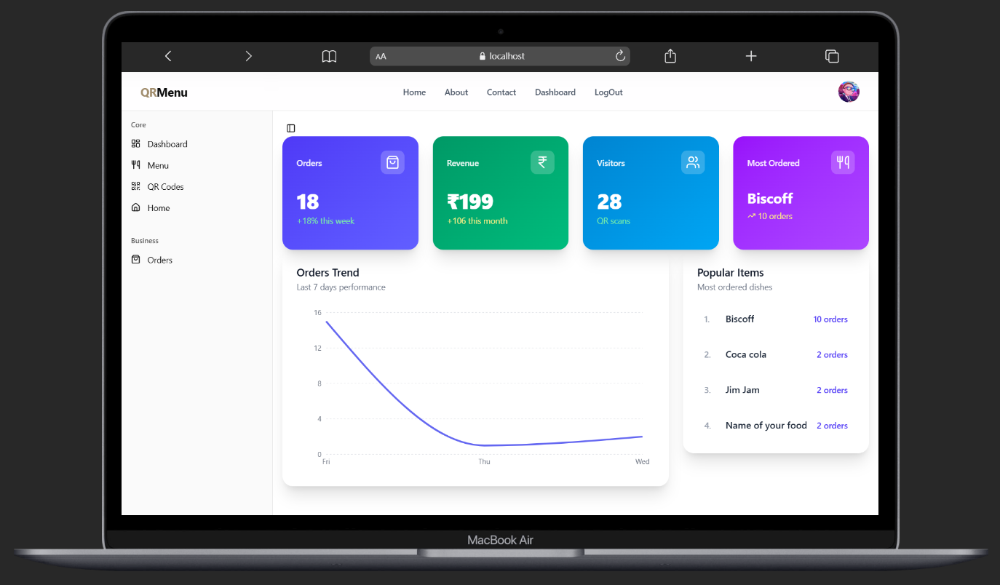
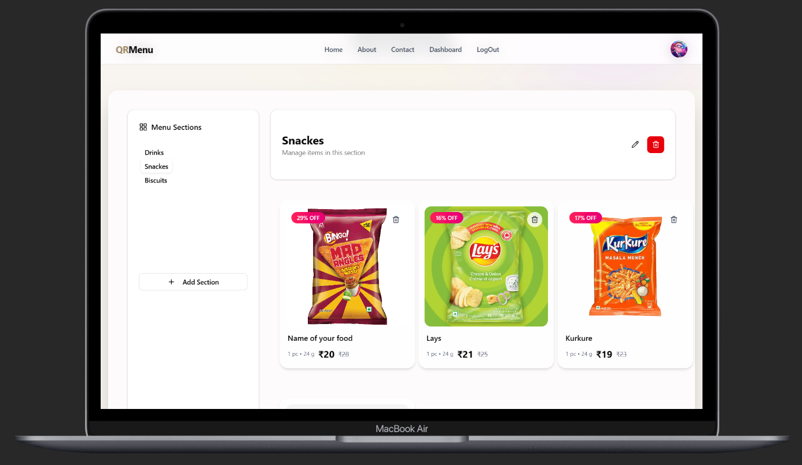
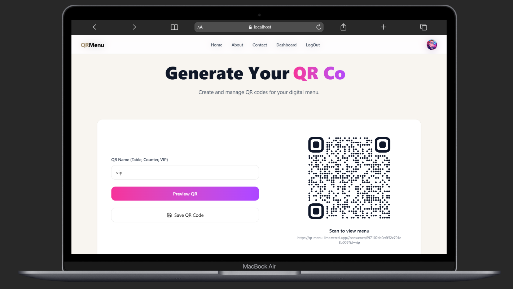
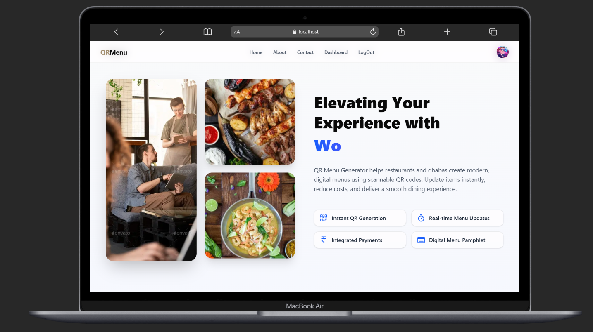
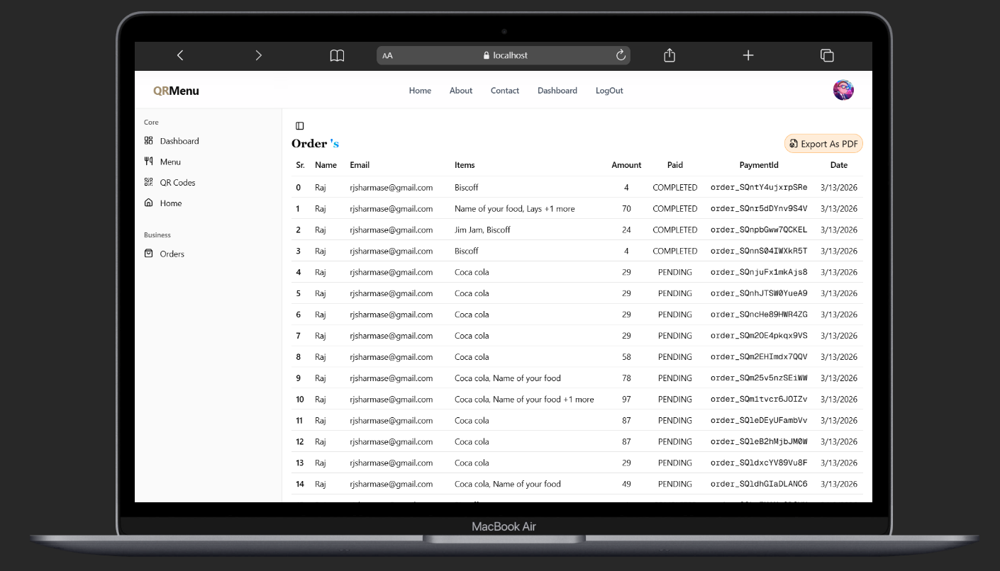
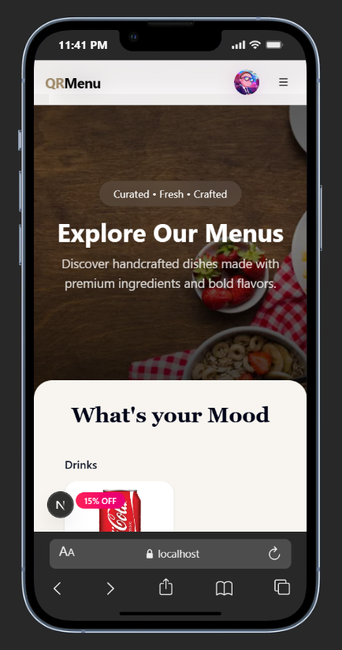
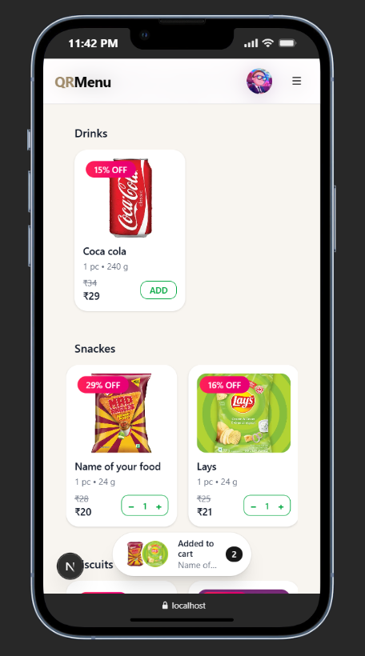
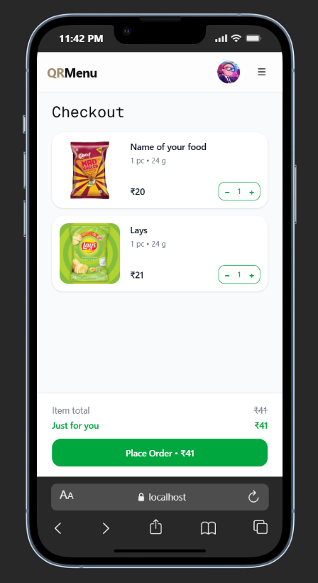
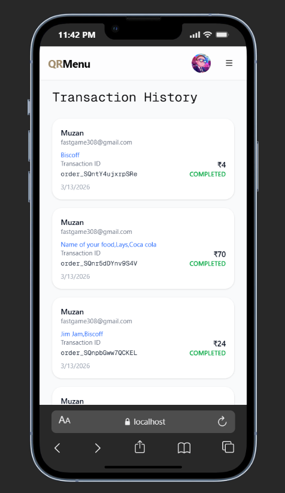

<div align="center">
  

  # 🍽️ **QR MENU**
  ### Digital Menu & Smart Ordering System 🚀

  <br />

  
  
  
  
  

  <br />

  ### [👉 📱 Experience the Mobile Customer UI Live!](https://qr-menu-lime.vercel.app/consumer/697102da0e6f52c701e8b009)
  
  <br />

  **Modernize your restaurant with a seamless, dynamic, and contactless digital dining experience.**

</div>

---

## � Overview

**QR MENU** is a cutting-edge digital restaurant menu and ordering platform built to replace traditional paper menus. Designed perfectly for modern restaurants, cafes, and bars, it empowers owners to dynamically update menus, generate unique table QR codes, and gain real-time insights into orders and revenue.

> ⚠️ **Note:** The AI-Powered Food Assistant feature has been temporarily removed during our TypeScript migration but will be making a return very soon!

<br />

## 🌟 Key Features

| Feature | Description |
| :--- | :--- |
| **🛡️ Type-Safe & Robust** | Rebuilt entirely in **TypeScript** for top-tier stability and maintainability. |
| **✨ Stunning UI** | A pristine, highly upgraded interface powered by **Tailwind CSS** & **Framer Motion**. |
| **📱 Dynamic QR Codes** | Unique QR codes per table for instant, frictionless ordering. |
| **� Seamless Payments** | Built-in **Razorpay** integration for secure and fast checkouts. |
| **📊 Real-Time Analytics** | Interactive graphs using **Recharts** to track revenue and trends. |
| **🔐 Secure Auth** | Custom **JWT & Bcrypt** implementation to keep merchant data safe. |
| **🖼️ Visual Menu Builder** | Drag-and-drop ordering and **Cloudinary** image hosting. |
| **� Export Capabilities** | Generate beautiful **PDF** invoices and QR codes on the fly. |

---

## 📸 Interface Showcase

<details>
<summary><b>🔥 Click to view Merchant Dashboard & Tools</b></summary>
<br>

| Admin Dashboard | Menu Builder |
| :---: | :---: |
|  |  |

| QR Builder | QR Services |
| :---: | :---: |
|  |  |

| Order History |
| :---: |
|  |

</details>

<details>
<summary><b>📱 Click to view Customer Experience</b></summary>
<br>

| Mobile Menu View 1 | Mobile Menu View 2 |
| :---: | :---: |
|  |  |

| Cart & Checkout | Transaction History |
| :---: | :---: |
|  |  |

</details>

---

## 🛠️ Tech Stack 

### **Frontend Interface**
- **Framework:** Next.js 15 (React 19)
- **Language:** TypeScript
- **Styling:** Tailwind CSS, Radix UI primitives
- **Animations:** Framer Motion
- **State Management:** Redux Toolkit

### **Backend & Infrastructure**
- **API:** Next.js Server API Routes
- **Database:** MongoDB & Mongoose
- **Authentication:** Custom JWT & Bcrypt
- **Payments Gateway:** Razorpay
- **Asset Storage:** Cloudinary
- **PDF Generation:** jsPDF

---

## � Getting Started

Follow these instructions to get a copy of the project up and running on your local machine.

### **1️⃣ Clone the Repository**
```sh
git clone https://github.com/yuvarajdudukuru/qr-menu.git
cd qr-menu
```

### **2️⃣ Install Dependencies**
```sh
npm install
```

### **3️⃣ Configure Environment**
Create a `.env` file in the root directory and add your credentials:
```sh
# Database
MONGO_URI=<-- your mongo db url -->

# Security
SALT_ROUNDS=<-- your salt rounds -->
JWT_SECRET="<-- your jwt secret -->"

# Cloudinary (Image Hosting)
CLOUDINARY_URL=<-- your cloudinary url -->
CLOUDINARY_CLOUD_NAME=<-- your cloudinary cloud name -->
CLOUDINARY_API_KEY=<-- your cloudinary api key -->
CLOUDINARY_API_SECRET=<-- your cloudinary api secret -->

# RazorPay (Payments)
NEXT_PUBLIC_RAZORPAY_KEY_ID=<-- your razorpay key id -->
RAZORPAY_KEY_ID=rzp_test_S7flSbkmha0t1U
RAZORPAY_KEY_SECRET=lzIiuyFiNj1Unx4tN7HiX7I8
```

### **4️⃣ Fire it up!**
```sh
npm run dev
```
Your app will be running at `http://localhost:3000`.

---

## 🤝 Contributing
Contributions are what make the open-source community such an amazing place to learn, inspire, and create. Any contributions you make are **greatly appreciated**.

1. Fork the Project
2. Create your Feature Branch (`git checkout -b feature/AmazingFeature`)
3. Commit your Changes (`git commit -m 'Add some AmazingFeature'`)
4. Push to the Branch (`git push origin feature/AmazingFeature`)
5. Open a Pull Request

---

## 📜 License
This project is intended for **educational purposes only**. If you wish to use it for commercial or other purposes, please request **permission**.

---

<div align="center">
  <b>Built with ❤️ by Yuvaraj Dudukuru</b> <br/>
   <a href="mailto:dudukuruyuvaraj55@gmail.com">dudukuruyuvaraj55@gmail.com</a>
</div>
